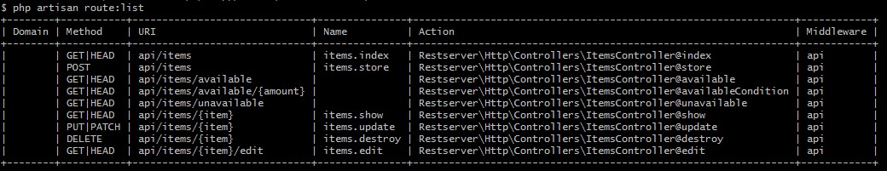

# laravel-rest-server
Package Rest Full API server for Laravel

You can see package Client API [package laravel-rest-client](https://github.com/prusmarcin/laravel-rest-client) for use on a separate Laravel installation

[](https://packagist.org/packages/prusmarcin/laravel-rest-server)
[](https://packagist.org/packages/prusmarcin/laravel-rest-server)
[](https://github.com/prusmarcin/laravel-rest-server/blob/master/LICENSE)

- [Installation](#installation)
- [Usage](#usage)
- [Testing](#testing)
- [Author](#author)
- [License](#license)

Installation
------------

To install this package you will need:

    Laravel 5 (see compatibility table)
    PHP 7.0 +


Install via composer - edit your `composer.json` to require the package.

``` json
{
    "require": {
        "prusmarcin/laravel-rest-server": "dev-master"
    }
}
```

Then run `composer update` in your terminal to pull it in.

Or via the command line in the root of your application installation.

``` bash
$ composer require prusmarcin/laravel-rest-server
```


Once this has finished, you will need to add the service provider to the `providers` array in your `app.php` config as follows:

``` php
\Restserver\RestserverServiceProvider::class,
```

And configure the database connection in `.env` file for your Laravel installation.

Run migration

``` bash
$ php artisan migrate
```
Note: If you have error when you run migration: "Specified key was too long error solution". Read this article: [https://geektnt.com/laravel-5-4-migration-unique-key-is-too-long.html](https://geektnt.com/laravel-5-4-migration-unique-key-is-too-long.html)

Run seeder

``` bash
$ php artisan db:seed --class=Restserver\\Seeds\\DatabaseSeeder
```

Run laravel server
``` bash
$ php artisan serve
```
And you're done!

Usage
-----

http://localhost:8000/api/items/available

Returns

``` json
[{"id":5,"name":"Produkt 8","amount":2},{"id":4,"name":"Produkt 7","amount":6},{"id":2,"name":"Produkt 2","amount":12},{"id":1,"name":"Produkt 1","amount":4}]
```

More methods:


Testing
-------
Run laravel server
``` bash
$ php artisan serve
```

Then run the tests with:

``` bash
$ vendor/bin/phpunit vendor/prusmarcin/laravel-rest-server
```


Author
-------

- [Prus Marcin](https://github.com/prusmarcin)
- [Portfolio](https://prusmarcin.pl/)


License
-------

The MIT License (MIT). Please see [License File](https://github.com/prusmarcin/laravel-rest-server/blob/master/LICENSE) for more information.